# I. Giới Thiệu và Thiết Lập

Nghiên cứu này là một phân tích nhằm khám phá cấu trúc và động lực xã hội của cộng đồng game thủ trên nền tảng Steam. Mục tiêu cốt lõi là định hình thành hai giai đoạn liên kết:

Phân Cụm Cộng Đồng (Clustering): Sử dụng các đặc trưng đa chiều (thời gian chơi game, thành tích, nhóm tham gia, và tương tác xã hội) để xác định và định danh các cộng đồng người dùng có hành vi đồng nhất.

Dự Đoán Mối Quan Hệ (Link Prediction): Ứng dụng kết quả phân cụm cộng đồǹg và các biến dữ liệu cá nhân, làm biến dự báo để xây dựng mô hình dự đoán khả năng kết bạn giữa các cặp game thủ trên mạng lưới Steam.

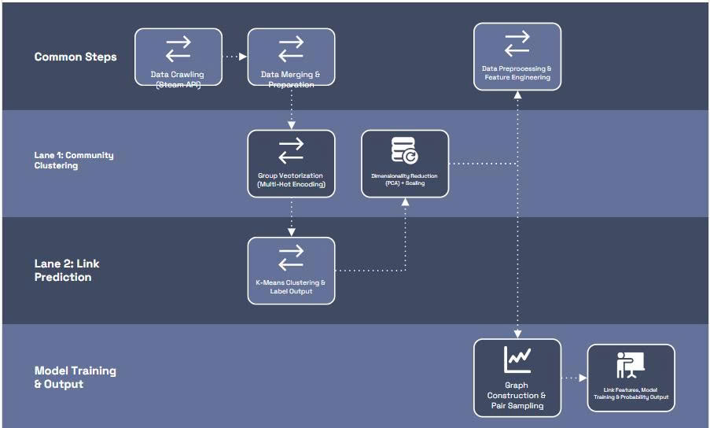


# II. Thu thập Dữ liệu (Data Acquisition)

Phần này mô tả chi tiết quy trình ** thu thập dữ liệu** từ Steam Web API và tạo tập dữ liệu thô.
Vì để vào steam communty để cào dữ liệu, người dùng sẽ bị chặn hoặc găp nhiều khó khăn trong quá trình thu thập như bị chặn hoặc capcha,.. .Chỉ có một cách là dùng account nào đủ uy tín ( đã mua game hoạc trade game có giao dịch trên 5usd sẽ được cấp Steam Web API Key). Sau khi có Key thì thực hiện thu thập dữ liệu

## 2.1 Cào dữ liệu từ Steam Web API

Dữ liệu được thu thập thông qua **Steam Web API**, một giao diện cho phép truy cập trực tiếp vào các thông tin công khai của người dùng và hệ sinh thái trên nền tảng Steam.  

Quá trình thu thập dữ liệu trải qua nhiều giai đoạn và thu thập nhiều loại thông tin. Đầu tiên, vì Steam Web API không cho phép cào dữ liệu một cách ngẫu nhiên, nên cần đưa vào steam id của một người dùng nào đó trên steam để API tìm, khi đó chương trình sẽ dẫn đến trang cá nhân của người đó.

Trong một trang cá nhân bao gồm nhiều thông tin như: id, tên, thời gian tham gia, nước, khu vực, số thành tựu, số trò chơi đã có, list bạn bè và nhóm tham gia,...
Để thu thập các thông tin trên ta sử dụng API endpoints( bao gồm các biến mà steam cung cấp để lấy các dữ liệu tương ứng): 

- GetFriendList : Lấy danh sách bạn bè của một người
- GetUserGroupList : Lấy danh sách nhóm của một người
- get_owned_games : Lấy danh sách game của một người
- get_owned_achievements: lấy danh sách thành tựu của một người

Và chỉ thu thập thông tin của người nào đặt trạng thái là public, các account để Private thì bo qua.
Sau khi thu thập xong một trang cá nhân thì chương trình sẽ chuyển hướng đến danh sách bạn bè của người đó, thực hiện truy cập vào trang cá nhân của người đó và tiếp tục thu thập. Chương trình sẽ tiếp tục thu thập theo hướng đó cho tới khi đủ 2000 người dùng public.

 
 
 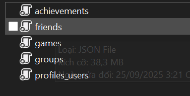
 
 
 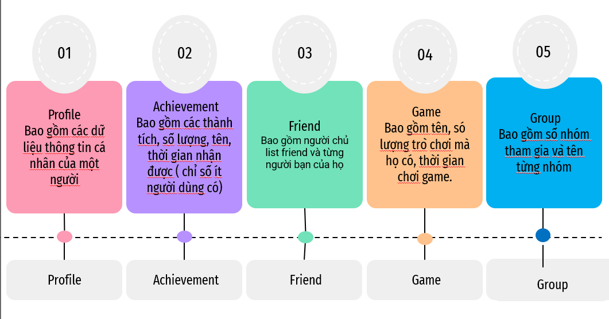
 
 

| Hạng mục         | Dữ liệu thu thập | Mục đích |
|------------------|------------------|----------|
| Profiles_Users   | Thông tin cơ bản: `timecreated`,`user_id`, `loccountrycode`,`personaname`, `loccountrycode`. | Tính tuổi tài khoản, vị trí địa lý. |
| Achievements     | Danh sách achievements và thời gian mở khóa. | Đo lường hành vi chơi game |
| Friends          | Danh sách bạn bè (`,friend_steamids_list`, `friend_count`). | Dữ liệu chính cho dự đoán mối quan hệ  |
| Games            | Danh sách game sở hữu, `playtime_forever`. | Tổng quan về dữ liệu trò chơi của người dùng |
| Groups           | Danh sách nhóm tham gia (`filtered_all_groups_gid_30`,`group_names`). | Dùng cho phân cụm cộng đồng. |


## 2.2 Gộp và Chuẩn bị Dữ liệu


Sau khi thu thập dữ liệu, trong thư mục dữ liệu sẽ có cấu trúc là 1 thư mục dữ liệu duy nhất, trong đó tất cả là dữ liệu người dùng được định dạng theo file json. 
đó.


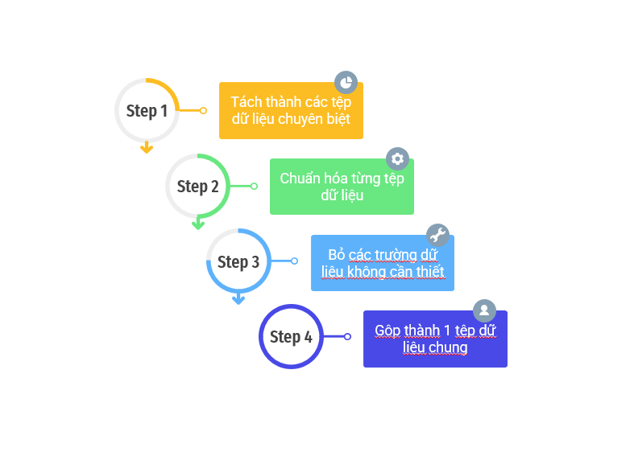


Bước tiếp theo là tiến hành gộp chúng lại để hình thành bộ dữ liệu hợp nhất ở mức người dùng. Và từ các trường dữ liệu sẵn có thì thực hiện tạo thêm các trường dữ liệu mới dựa vào dữ liệu đã có như:


Quá trình này gồm các bước chính:


1. **Xác định khóa chính (Primary Key)**  
   - Sử dụng `user_id` (hay `steamID`) làm định danh duy nhất cho mỗi người dùng.  
   - Mọi bảng dữ liệu phụ (achievements, games, groups, friends) đều được ánh xạ về bảng chính thông qua khóa này.  

2. **Chuẩn hóa dữ liệu trước khi gộp**  
   - Đảm bảo các trường có định dạng đồng nhất:  
     - Thời gian (`timecreated`) → chuyển sang dạng **datetime** 
     - Các cột nhị phân (`is_old_account`, `is_VN`,`in_game_group`, `in_fan_group`,`in_platform_group`) → chuẩn về 0/1.  
     - Các biến dạng chuỗi nhiều giá trị (như danh sách group) → chuyển sang vector đa nhãn 


4. **Xóa các cột dữ liệu không cần thiết cho phân tích **  
   - Xóa các cột như: "realname", "profilestate", "personastate", "primaryclanid",
    "game_achievements_summary", "total_playtime_forever", "avatarfull"
    
5. **Tạo bảng hợp nhất cuối cùng**  
   - Mỗi hàng = 1 người dùng.  
   - Các cột đặc trưng:  
     - **Thông tin cơ bản**: `user_id`, `account_age_years`, `loccountrycode`.  
     - **Hoạt động chơi game**: `total_games`, `total_playtime_hours`, `avg_playtime_per_game`.  
     - **Thành tựu**: `total_achievements`.  
     - **Xã hội**: `friends_count`, `group_count`, `social_factor`.  
     - **Group Membership**: vector nhị phân từ `gid`.  

6. **Tạo thêm các trường dữ liệu khác dựa vào dữ liệu đã có**  
    
 - cột `timecreated` tạo ra được cọt `account_age_years`,`account_age_da    total_playtime_hours `, `is_old_account`
 
 
 - Cột `loccountrycode` tạo ra được cột `is_VN`, cột `locstatecode` tạo ra được cột `region` và cột `ten_tinh`


 - Cột `game` tạo được cột `total_game` , `avg_playtime_per_game`    
 
 
 - Cột `group` tạo được cột `filtered_all_groups_gid_30` , `big_group_member` , `group_count`, `in_game_group` , `in_fan_group` ,`in_platform_group` , `group_name` , `social_factor`         
 
 
 - Cột `Friend` tạo được cột `friend_steamids_list`, ` friend_count`
 
 
 - Cột `Achivement` tạo được cột ` total_achievements`


7. **Bộ dữ liệu hoàn chỉnh**
```{r}

                                      
# Đọc dữ liệu CSV
df <- read.csv("data_users.csv")

# Hiển thị tất cả tên cột
colnames(df)
```
     

# III. Tiền xử lý và Tạo Đặc trưng (Feature Engineering & Preprocessing)

Sau khi dữ liệu thô từ nhiều nguồn đã được gộp lại thành một **bảng hợp nhất** ở mức người dùng, bước tiếp theo là **tiền xử lý dữ liệu** và **xây dựng đặc trưng**. Đây là giai đoạn then chốt, quyết định chất lượng của phân tích và mô hình sau này.

## 3.1 Tạo Đặc trưng có giá trị phân tích

Một số đặc trưng quan trọng được tính toán từ dữ liệu gốc:

- **Tuổi tài khoản**  
  - `account_age_years` = (ngày hiện tại – `timecreated`) / 365.  
  - Dùng để phân loại người dùng mới và cũ (`is_old_account`).  

- **Chỉ số hoạt động chơi game**  
  - `total_games`: số lượng game sở hữu.  
  - `total_playtime_hours`: tổng thời gian chơi (giờ).  
  - `avg_playtime_per_game`: trung bình giờ chơi trên mỗi game.  

- **Chỉ số thành tích**  
  - `total_achievements`: tổng số achievement đã mở khóa.  
  - Phản ánh mức độ "try-hard" của người chơi.  

- **Đặc trưng xã hội**  
  - `friends_count`: số lượng bạn bè 
  - `friend_steamids_list`: danh sách bạn bè.   
  - `group_count`: số nhóm tham gia.  
  - `social_factor`: kết hợp số bạn bè và số nhóm, nhằm đo lường mức độ gắn kết xã hội.  

- **Đặc trưng nhị phân (One-hot/Binary Features)**  
  - `is_VN`: người dùng có mã quốc gia = Việt Nam.  
  - `in_game_group`, `in_platform_group`, `in_fan_group`: xác định kiểu nhóm mà user tham gia.  

## 3.2 Xử lý dữ liệu và Chuẩn hóa

Để đảm bảo dữ liệu ổn định cho mô hình:

1. **Xử lý dữ liệu thiếu (Missing Values)**  
  A. **Điền bằng Giá trị Trung vị (Median Imputation)**
 Sử dụng giá trị trung vị để điền vào các cột có tính chất số liên tục nhằm giảm thiểu ảnh hưởng của các giá trị ngoại lai (outliers):

 - Tổng số game (`total_games`): Giá trị thiếu được điền bằng trung vị của toàn bộ cột.

 - Ngày tạo tài khoản (`timecreated`): Sau khi cột này được chuyển đổi sang định dạng datetime, các giá trị còn thiếu cũng được điền bằng trung vị của thời gian tạo tài khoản.

  B. **Điền bằng Giá trị Số Mặc định (0 Imputation)**

 - Các cột liên quan đến trạng thái hoặc số lượng vật lý được điền bằng 0, ngụ ý rằng thông tin hoặc hoạt động đó không tồn tại:

 - Tổng thời gian chơi (`total_playtime_hours`): Nếu thiếu, gán bằng 0, giả định người chơi chưa có thời gian chơi được ghi nhận.

 - Tổng thành tích (`total_achievements`): Nếu user không có thành tích, gán 0.

 - Trạng thái hồ sơ (`profilestate`) và Tổng số nhóm (`total_groups`): Các cột này cũng được điền bằng 0 (giá trị mặc định hoặc không hoạt động).

  C. **Điền bằng Chuỗi ký tự (String Imputation)**
 
Chúng tôi sử dụng các chuỗi ký tự mô tả để điền vào các giá trị bị thiếu trong dữ liệu phân loại hoặc dữ liệu văn bản:

 - Tên người dùng (`personaname`): Điền bằng 'Unknown'.

 - Tên tỉnh/thành (`ten_tinh`): Điền 'UNKNOWN'.

 - Mã quốc gia (`loccountrycode`): Nếu thiếu, giá trị mặc định là 'VN' (Việt Nam) hoặc 'Unknown' trong các trường hợp khác.

 - Tóm tắt thành tích game (`game_achievements_summary`): Thay giá trị thiếu bằng None.

 - Danh sách Group GID (`all_groups_gid`): Điền chuỗi rỗng '[]' để chuẩn bị cho việc xử lý cấu trúc dữ liệu mảng sau này.

 - Xử lý Mã tỉnh/thành (`locstatecode`): Cột này có quy tắc riêng biệt. Nếu quốc gia là 'VN' nhưng mã tỉnh/thành bị thiếu, chúng tôi gán một số ngẫu nhiên từ 1 đến 63 để mô phỏng 63 tỉnh/thành của Việt Nam. Với các quốc gia khác, giá trị được điền là 'Unknown'. 


2. **Xử lý ngoại lệ (Outliers)**  
   - Áp dụng Winsorization (giới hạn theo IQR) cho các biến có phân phối lệch mạnh (`total_playtime_hours`, `total_achievements`,`total_games`, `account_age_years`, `avg_playtime_per_game`).  
   - Giúp giảm ảnh hưởng của các user có hành vi bất thường (ví dụ: chơi 50,000 giờ).  
   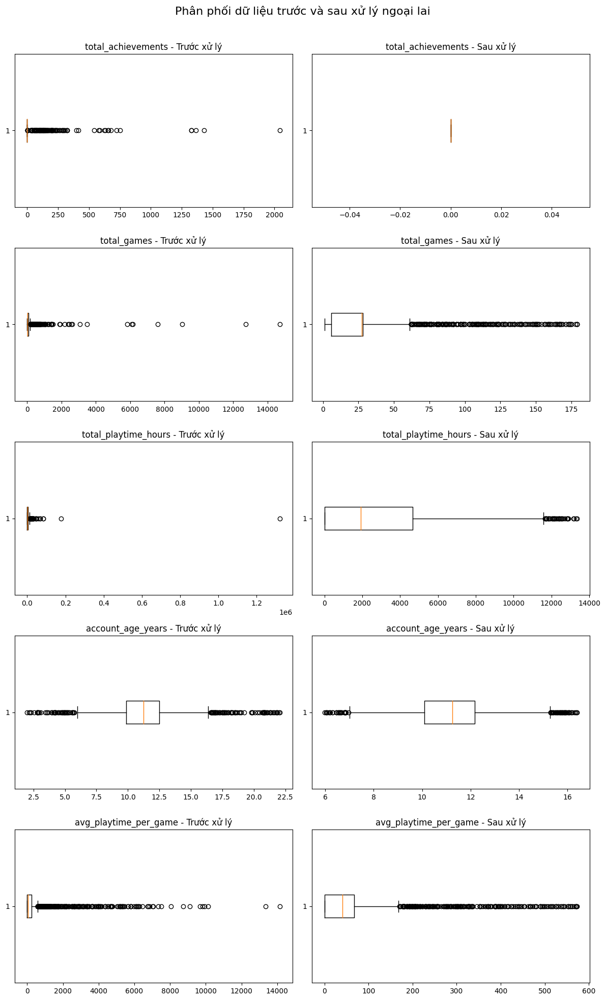


3. **Chuẩn hóa dữ liệu số**  
   - Các biến số (`total_games`, `avg_playtime_per_game`,`total_playtime_hours`,
    `friend_count`, `group_count`, `new_group_count`, `social_factor`,
    `account_age_days`, `account_age_years` …) được chuẩn hóa bằng **StandardScaler** (Z-score).  
   - Đảm bảo các đặc trưng có cùng thang đo trước khi đưa vào mô hình (K-Means, PCA, …).  

## 3.3 Kết quả sau tiền xử lý

Sau khi hoàn tất tiền xử lý, dữ liệu người dùng đã được làm sạch, chuẩn hóa và sẵn sàng cho phân tích. Tất cả giá trị thiếu được xử lý bằng 0, trung vị hoặc chuỗi mặc định; các ngoại lệ được giới hạn bằng phương pháp Winsorization (IQR clipping) để loại bỏ ảnh hưởng của người dùng bất thường. Toàn bộ các biến số được chuẩn hóa bằng StandardScaler, giúp các đặc trưng có cùng thang đo. Kết quả thu được là một bảng dữ liệu hợp nhất gồm khoảng 2.000 người dùng và hơn 25 đặc trưng phản ánh hành vi, hoạt động và mức độ gắn kết xã hội. Dữ liệu sau xử lý đạt 0% giá trị thiếu, không còn ngoại lệ, phân phối cân bằng và sẵn sàng cho bước phân tích giảm chiều (PCA) và phân cụm người dùng.

## 3.4 TRực quan hóa dữ liệu

Sau khi tiền xử lý, dữ liệu được trực quan hóa nhằm đánh giá phân phối, sự cân bằng và mối quan hệ giữa các đặc trưng:

### 3.4.1 Phân phối các biến số:
Các đặc trưng định lượng như `total_games`, `total_playtime_hours`, `avg_playtime_per_game`, `friend_count`, `group_count`… có phân phối lệch phải (skewed), cho thấy phần lớn người dùng có mức độ hoạt động thấp, chỉ một số ít có giá trị rất cao. Biến account_age_days có dạng gần chuẩn, phản ánh sự phân bố đồng đều giữa các tài khoản mới và cũ.
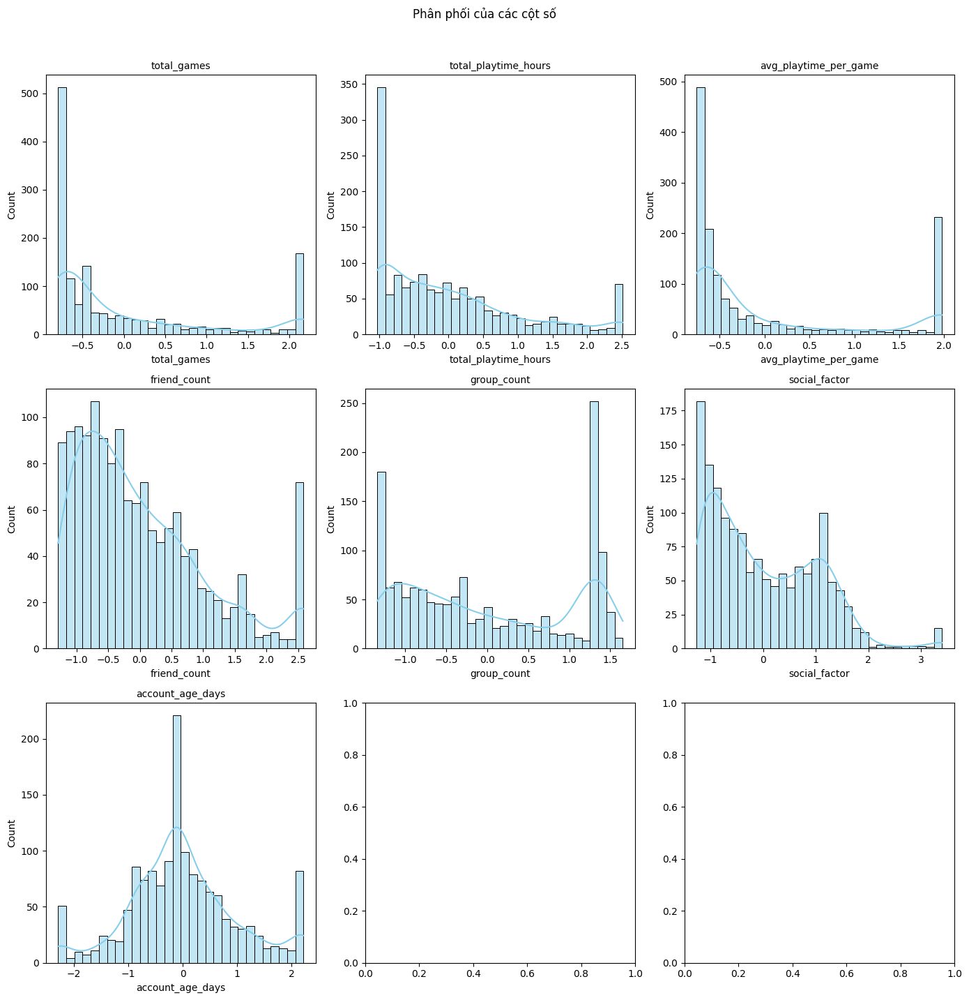


### 3.4.2 Phân phối các biến phân loại:
Dữ liệu nhị phân như `is_old_account`, `in_game_group`, `in_platform_group`, `in_fan_group`… nhìn chung khá cân bằng, ngoại trừ một vài biến có xu hướng lệch (ví dụ, phần lớn người dùng thuộc nhóm in_fan_group = 1). Biến region phân bố đều giữa các vùng, đảm bảo dữ liệu không bị thiên lệch địa lý.
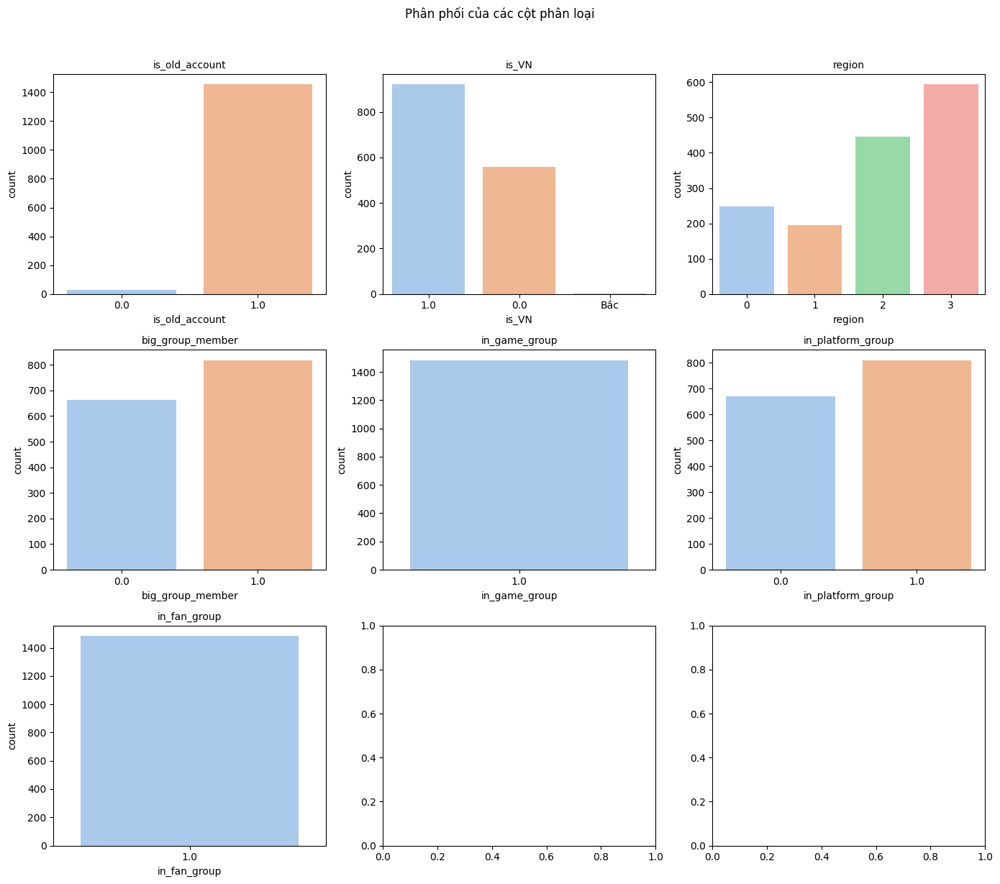


### 3.4.3 Tương quan giữa các biến số:
Ma trận tương quan (heatmap) cho thấy các đặc trưng `group_count`, `new_group_count` và `social_factor` có mức tương quan cao (≈ 0.9), phản ánh chúng cùng mô tả mức độ tham gia nhóm xã hội. Trong khi đó, các biến như `total_games`, `total_playtime_hours`, `friend_count`, `account_age_days` có tương quan yếu, thể hiện tính độc lập, phù hợp cho các mô hình phân tích đa chiều.
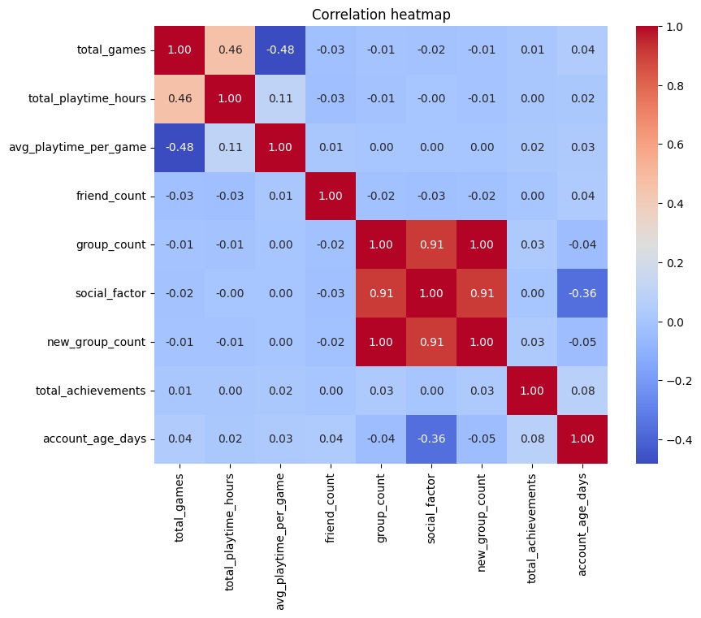


## 3.4 Liên Kết Xã Hội
Vì Steam là một nền tảng chơi game online đa nề tảng, gióng như một mạng xã hội của các gamer nên người dùng không chỉ thể hiện hoạt động cá nhân thông qua việc chơi game mà còn hình thành mối quan hệ xã hội với những người chơi khác thông qua các nhóm, bạn bè, hoặc cộng đồng chung.
Do đó, việc phân tích liên kết xã hội giúp hiểu sâu hơn về cấu trúc tương tác, mức độ kết nối, và ảnh hưởng xã hội của từng người dùng trong hệ sinh thái này.
 
### 3.4.1 Số node và số cạnh
Sau khi xử lý dữ liệu, số lượng node trong mạng xã hội tương ứng với số người dùng hợp lệ (không trùng lặp), còn số lượng cạnh được tính dựa trên tổng số quan hệ bạn bè có thật giữa các người dùng có trong tập dữ liệu.

Trong bộ dữ liệu này: số node là 1482 và số cạnh là: 57796

### 3.4.2 Đồ thị biểu diễn lien kết xã hội
- Để trực quan hóa cấu trúc kết nối, đồ thị mạng được vẽ với mỗi node là một người dùng, và cạnh thể hiện mối quan hệ bạn bè.

#### **A  đồ thị biểu diễn sứ lien kết của 100 users đầu tiên**

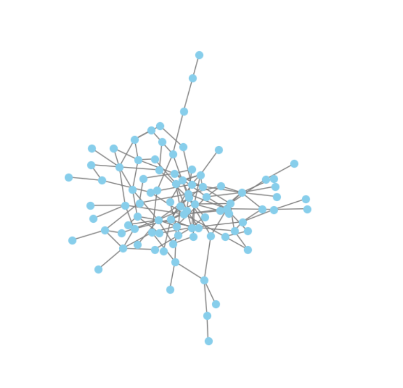


Phần lớn các nút (người dùng) tập trung ở vùng trung tâm, cho thấy có một cộng đồng chính trong đó nhiều người có mối liên kết lẫn nhau.

Một số nút nằm rải rác ở ngoài, thể hiện các người dùng cô lập hoặc chỉ có ít kết nối (thậm chí không có bạn chung).

Mạng lưới chưa quá dày đặc, tức là mức độ kết nối giữa người dùng vẫn còn hạn chế — nhiều người chỉ có 1–2 liên kết.

Sự xuất hiện của một cụm lớn trung tâm cho thấy có khả năng tồn tại một nhóm người dùng hoạt động mạnh hoặc có sở thích chung.

Một vài thành phần tách biệt (disconnected components) ở rìa biểu đồ thể hiện những nhóm nhỏ hoặc cá nhân không liên hệ với mạng chính.


#### **B đồ thị biểu diễn đầy đủ sự lien kết giữa các người chơi:**
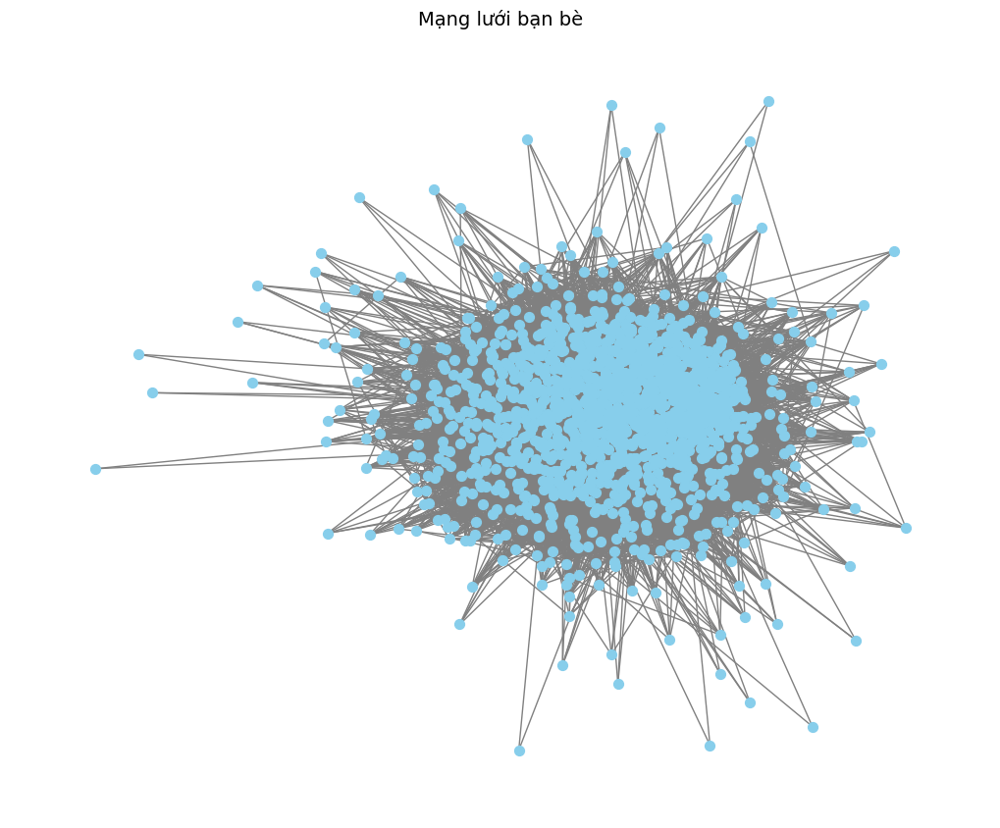
Mạng lưới có mật độ kết nối cao, thể hiện qua vùng trung tâm dày đặc, nơi nhiều người dùng có mối quan hệ chồng chéo.

Xuất hiện một cộng đồng chính rất lớn, trong đó hầu hết người dùng đều liên kết với nhau, cho thấy tính liên thông mạnh giữa các tài khoản.

Một số nút nằm ở rìa hoặc tách biệt, biểu hiện cho các người dùng ít bạn hoặc chỉ kết nối với một số thành viên trong mạng.

Cấu trúc này gợi ý rằng hệ thống có một mạng xã hội trung tâm (core network), với các nhóm nhỏ hơn lan tỏa xung quanh.


#### **C  là biểu đồ tương quan thể hiện sự tương đồng của người dùng thể hiện qua các biến dữ liệu**
 
Vì nếu vẽ ra toàn bộ 1498 người thì rõ ràng biểu đồ rất khó nhìn, nên ở đây chỉ biểu diễn trên  10 người đầu tiên.

Các yếu tố để xét sự tương đồng là: "loccountrycode", "region", "ten_tinh","in_game_group", "in_platform_group", "in_fan_group", "friend_steamids_list".
bao gồm: Quốc gia, khu vực (Bắc/Trung/Nam), tên tỉnh/thành phố, nằm trong các nhóm đã được phân loại, và có bạn chung
Cách tính điểm trên biểu đồ tương quan là: Nếu 2 người có 1 bạn chung thì cộng 0.2 điểm, các yếu tốc khác chung sẽ đươc cộng 1 điểm.
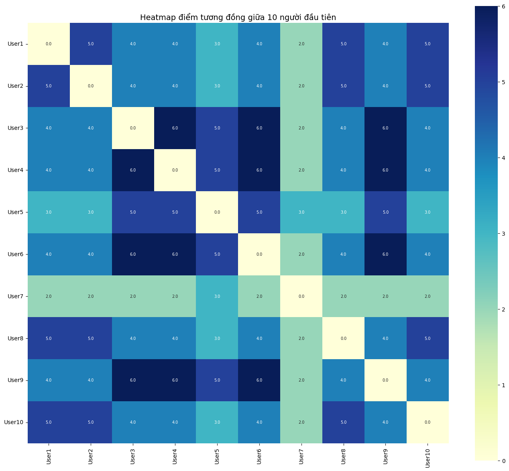

Biểu đồ heatmap thể hiện điểm tương đồng giữa 10 người dùng đầu tiên trong tập dữ liệu. Quan sát cho thấy:

Các ô màu đậm (xanh đậm) biểu thị cặp người dùng có mức độ tương đồng cao, tức là họ có nhiều đặc điểm giống nhau (ví dụ: cùng quốc gia, cùng vùng, tham gia nhóm giống nhau hoặc có bạn chung).

Các ô màu nhạt (xanh nhạt hoặc vàng nhạt) biểu thị mức độ tương đồng thấp, tức là hai người dùng có ít điểm chung hơn.

Đường chéo chính có giá trị 0 vì mỗi người không so sánh với chính mình.

Một số nhóm người dùng (ví dụ User3–User4–User6–User9) có điểm tương đồng cao lặp lại, cho thấy họ có thể thuộc cùng cộng đồng hoặc nhóm hành vi tương tự.

Ngược lại, các người dùng như User7 có giá trị tương đồng thấp hơn với hầu hết người khác, cho thấy họ ít điểm chung hơn với phần còn lại.


## IV.Phân cụm cộng đồng.

Mục tiêu chính của bước này là xác định và phân loại các nhóm người dùng có hành vi và đặc điểm tương đồng dựa trên các thông tin về hoạt động, tương tác xã hội và sở thích cá nhân. Việc này giúp:

- Hiểu rõ cấu trúc tiềm ẩn của mạng xã hội người dùng,

- Nhận diện các nhóm có liên kết mạnh nội bộ,

- Và tạo nền tảng cho phân tích hành vi, gợi ý kết nối hoặc đề xuất nội dung ở các bước sau.

### 4.1 Quy trình thực hiện

- Xây dựng mạng xã hội (graph)

Mỗi người dùng được biểu diễn bởi một nút (node).

Mỗi mối quan hệ hoặc tương tác giữa hai người được biểu diễn bằng cạnh (edge) có trọng số (weight) thể hiện mức độ liên kết.

Từ dữ liệu ban đầu (file edges.csv), ta xây dựng đồ thị vô hướng để phản ánh mạng lưới kết nối giữa người dùng.

- Làm sạch và tiền xử lý dữ liệu

Loại bỏ các cạnh trùng lặp, tự kết nối 

Giữ lại các cạnh có trọng số lớn hơn ngưỡng tối thiểu nhằm loại bỏ nhiễu.

- Phân cụm cộng đồng

Áp dụng 4 mô hình phân cụm cộng đồng phổ biến: Louvain, Leiden, Spectral Clustering và Hybrid (kết hợp học đặc trưng và phát hiện cộng đồng).

Mỗi mô hình đều có cách tiếp cận và ưu điểm riêng trong việc phát hiện cấu trúc mạng.

### 4.2 Giải thích nguyên lý hoạt động của các mô hình

1. Louvain Method

Là thuật toán tối ưu hóa chỉ số mô-đun (modularity) để phát hiện cộng đồng.

Nguyên lý hoạt động:

Gán mỗi node vào một cộng đồng riêng biệt.

Duyệt qua từng node và di chuyển nó sang cộng đồng láng giềng nào làm tăng modularity nhiều nhất.

Sau khi không thể cải thiện modularity, gom các node cùng cộng đồng thành siêu-node (supernode) → tạo đồ thị mới.

Lặp lại quá trình cho đến khi modularity hội tụ.

Đặc điểm: nhanh, hiệu quả với đồ thị lớn; tuy nhiên có thể cho ra kết quả khác nhau qua mỗi lần chạy (vì tính ngẫu nhiên).

2. Leiden Method

Là phiên bản cải tiến của Louvain, giúp khắc phục vấn đề cộng đồng rời rạc hoặc chưa được kết nối trong Louvain.

Nguyên lý hoạt động:

Bắt đầu giống Louvain (gán mỗi node một cộng đồng).

Thêm bước Refinement phase: đảm bảo các cộng đồng được tạo ra là liên thông (connected).

Gom các cộng đồng nhỏ thành siêu-node, sau đó lặp lại như Louvain.

Ưu điểm: tạo ra các cộng đồng ổn định hơn, chất lượng cao hơn và đảm bảo tính liên thông.

3. Spectral Clustering

Là phương pháp phân cụm dựa trên phổ (eigenvalues) của ma trận đồ thị, thường dùng cho các mạng có trọng số hoặc cấu trúc phức tạp.

Nguyên lý hoạt động:

Tính ma trận Laplacian của đồ thị


Biểu diễn mỗi node bằng vector đặc trưng tương ứng → tạo không gian nhúng mới.

Áp dụng thuật toán K-means để phân cụm các node trong không gian này.

Ưu điểm: cho kết quả tốt khi đồ thị có cấu trúc phức tạp, tuy nhiên tốn tài nguyên tính toán khi số node lớn.

4. Hybrid Model (Mô hình lai)

Là mô hình kết hợp giữa phương pháp học đặc trưng (graph embedding) và thuật toán phát hiện cộng đồng truyền thống.

Nguyên lý hoạt động:

Dùng kỹ thuật nhúng đồ thị (ví dụ: Node2Vec, DeepWalk, hay GraphSAGE) để biểu diễn mỗi node bằng vector đặc trưng liên tục phản ánh mối quan hệ mạng.

Sau đó, áp dụng thuật toán phát hiện cộng đồng như Louvain hoặc K-means trên không gian vector này.

Ưu điểm: nắm bắt tốt hơn ngữ nghĩa và cấu trúc ẩn sâu, cho phép phân tách cộng đồng theo ngữ cảnh hành vi, không chỉ dựa vào liên kết trực tiếp.

### 4.3 Kết Quả Phân Cụm

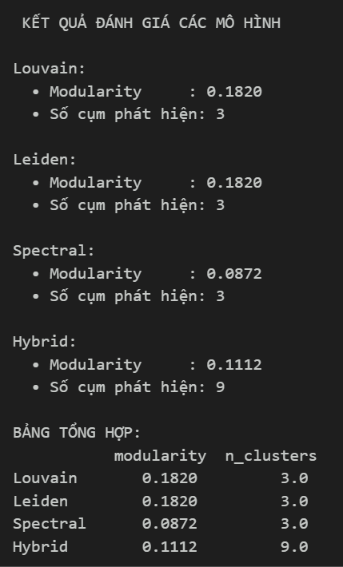

| Mô hình                        | Modularity | Số cụm phát hiện | Nhận xét |
|--------------------------------|------------|-----------------|----------|
| Louvain                        | 0.1820     | 3               | Cho kết quả tốt, modularity cao nhất, biểu thị mạng có cấu trúc cộng đồng rõ ràng nhất trong 4 mô hình. |
| Leiden                         | 0.1820     | 3               | Hiệu quả tương đương Louvain, xác nhận độ tin cậy của kết quả. Ưu điểm là ổn định và xử lý được các cụm nhỏ hơn Louvain. |
| Spectral                       | 0.0872     | 3               | Modularity thấp, nghĩa là các cụm không tách biệt rõ ràng. Thuật toán dựa trên ma trận Laplacian và giả định cụm hình cầu, nên không phù hợp với mạng xã hội dạng không đều. |
| Hybrid (Louvain + Spectral)    | 0.1112     | 9               | Phát hiện nhiều cụm nhỏ hơn, giúp chia tách sâu các nhóm lớn của Louvain. Tuy nhiên modularity giảm, chứng tỏ chia quá nhỏ có thể làm mất tính liên kết cộng đồng. |


Modularity đo mức độ “tách biệt” giữa các cụm:

Giá trị cao (≈0.18) → mạng có cấu trúc cộng đồng tương đối rõ ràng.

Giá trị thấp (≈0.08) → các cụm bị chồng lấn, ít ranh giới.

Số cụm phát hiện:

Louvain & Leiden cùng phát hiện 3 cụm lớn ổn định.

Hybrid tạo 9 cụm nhỏ hơn, nghĩa là có sự phân rã bên trong cụm.

Spectral giữ nguyên 3 cụm, nhưng chất lượng phân tách kém hơn.

Louvain và Leiden đạt modularity cao nhất,cho thấy đây là hai mô hình phù hợp nhất để phát hiện cấu trúc cộng đồng trong mạng xã hội người dùng. Spectral có modularity thấp do đặc trưng mạng phức tạp, trong khi mô hình Hybrid giúp phát hiện thêm các tiểu cộng đồng nhưng làm giảm chất lượng tổng thể của phân cụm.


#### 4.4 Trực quan hóa 

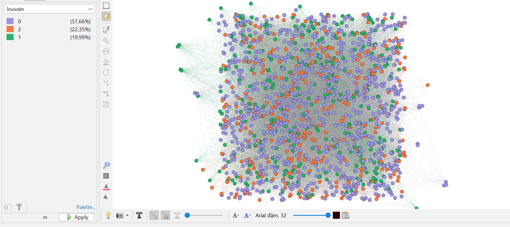
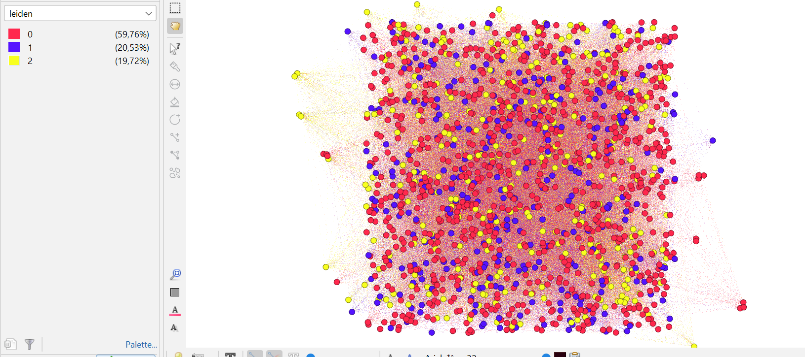
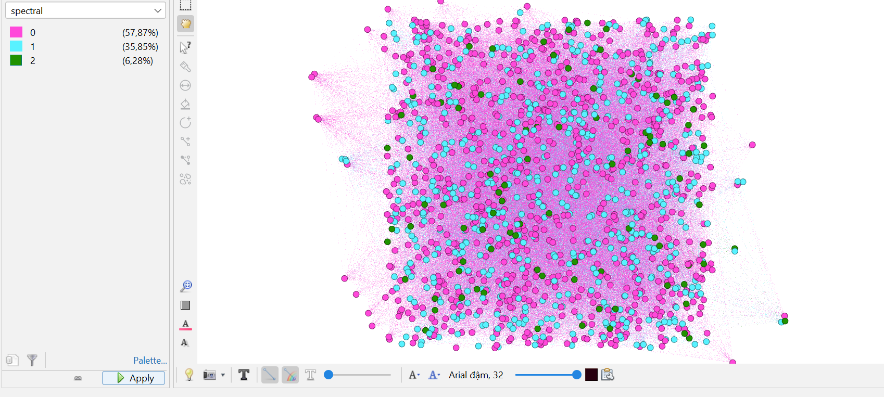
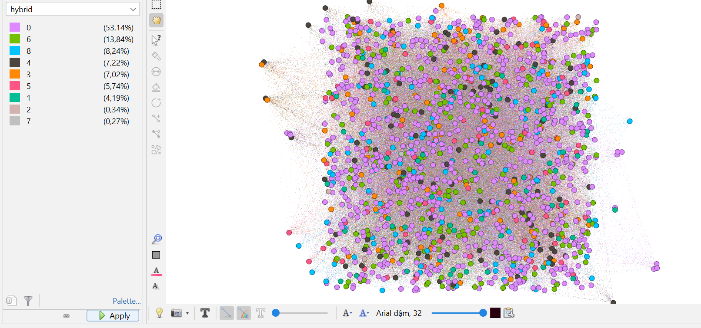


  

# V. Kết luận

Quy trình phân cụm đã thành công trong việc phân đoạn người dùng thành các nhóm có ý nghĩa thông qua bốn mô hình Louvain, Leiden, Spectral và Hybrid. Các phân cụm này giúp nhận diện các nhóm người dùng có hành vi tương đồng, trong đó Louvain và Leiden tạo ra cấu trúc cộng đồng rõ ràng nhất với modularity cao, còn Hybrid giúp tách các nhóm lớn thành các cụm nhỏ hơn để phân tích chi tiết hơn. Các nhãn cụm đóng vai trò như các biến đại diện mạnh mẽ, cô đọng hành vi phức tạp của người dùng và có thể được sử dụng trong các mô hình dự đoán để cải thiện tính cá nhân hóa gợi ý kết nối, nâng cao độ chính xác và thúc đẩy các mối quan hệ tích cực giữa người chơi.